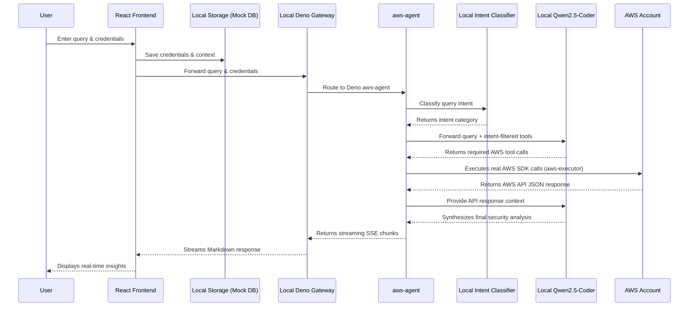

# CloudPilot AI

Real-time AWS security operations. Connect your credentials to audit, investigate, and remediate cloud infrastructure. An elite AWS cloud security operations agent built exclusively for professional security engineers, featuring zero simulation tolerance (always uses real AWS API calls).


📚 **Read the full [Technical Documentation](TECHNICAL_DOCUMENTATION.md) for a comprehensive breakdown of the architecture, data flow, and codebase.**


---

## System Architecture


<div align="center">
  <em>Figure 1: CloudPilot AI System Architecture and Request Flow</em>
</div>

### Architecture Explanation

1. **User Interaction**: The user accesses the React Frontend, inputs their AWS query (e.g., "Find exposed S3 buckets"), and provides their AWS credentials (either Access Keys or an AssumeRole ARN).
2. **Request Handling**: The frontend securely sends the prompt and credentials to the Local Deno Gateway (`local-server.ts`), which mounts and executes the `aws-agent` module locally on port 54321.
3. **Intent Classification**: Before engaging the main AI model, `aws-agent` sends the query to the local `qwen2.5-coder` model (via Ollama) for intent classification. The classifier categorizes the query into one of 9 domains (e.g., `security_audit`, `cost_analysis`, `drift_detection`), and only the relevant tool subset is selected for the main agent. This reduces token usage by 40-70% on focused queries.
4. **AI Evaluation**: The local Deno router builds the system context (enforcing "zero simulation tolerance") and communicates with the local `qwen2.5-coder` model via Ollama's completions API, providing only the filtered tool definitions for the classified intent.
5. **AWS Integration**: When the AI determines it needs data, it requests a tool call to `execute_aws_api`. The local gateway dynamically instantiates an AWS SDK client using the user's provided credentials and executes the requested API call against the user's real AWS account via the `aws-executor` module.
6. **Synthesis & Streaming**: The real AWS API responses are passed back to the AI model. The model synthesizes an executive summary, findings table, detailed analysis, and exact CLI remediation commands. The gateway streams this synthesized response back to the React Frontend for real-time display via SSE.
7. **Database Storage**: Conversations, user sessions, runbooks, compliance configurations, and drift baselines are persisted completely client-side inside the browser's `localStorage` mock client, guaranteeing zero setup and 100% offline data privacy.

---

## Smart Intent Router — Two-Model Architecture

CloudPilot AI employs a lightweight LLM-based intent router that classifies each user query before engaging the main agent:

| Component | Model | Purpose |
|-----------|-------|---------|
| **Intent Classifier** | Qwen2.5-Coder (via Ollama) | Single-shot query classification into 9 intent categories (~100-200ms) |
| **Main Agent** | Qwen2.5-Coder (via Ollama) | Multi-iteration agentic loop with filtered tool set (up to 15 iterations) |

### Intent Categories

| Intent | Tools Selected | Example |
|--------|---------------|---------|
| `security_audit` | 4 tools | "Audit my S3 buckets" |
| `cost_analysis` | 3 tools | "Where am I wasting money?" |
| `drift_detection` | 3 tools | "Show overnight drift" |
| `org_management` | 3 tools | "Which accounts lack MFA?" |
| `ops_automation` | 4 tools | "Run incident response playbook" |
| `attack_simulation` | 3 tools | "Simulate privilege escalation" |
| `event_automation` | 3 tools | "If anyone opens port 22, close it" |
| `direct_query` | 1 tool | "List my S3 buckets" |
| `general` | All 15 tools | Ambiguous or multi-domain queries |

### Why Qwen2.5-Coder?

- **100% Private and Local**: Runs entirely on your local machine. No credentials, tokens, or audit logs leave your network.
- **Top-Tier Tool Calling**: Specially fine-tuned to emit structured JSON API calls, allowing the agentic loop to consistently select correct AWS SDK operations.
- **Zero API Cost & Key Setup**: No developer keys, credits, or rate limits. You can run unlimited security scans offline.

---

## Automated Scheduling — pg_cron

The `guardian-scheduler` edge function runs automatically every hour via PostgreSQL's native `pg_cron` extension, eliminating the need for external scheduling services:

- **Schedule**: `0 * * * *` (top of every hour)
- **Mechanism**: `pg_net` HTTP POST from within the database to the edge function endpoint
- **Authentication**: `x-guardian-secret` header validates against `GUARDIAN_AUTOMATION_WEBHOOK_SECRET`
- **Actions**: Cost anomaly scanning, drift detection, and SNS alert dispatch

This approach is simpler than AWS EventBridge because it runs inside the database with zero external dependencies.

---

## Key Features

- **Live AWS API Execution**: Connect your credentials to audit, investigate, and remediate cloud infrastructure using real AWS API responses.
- **Smart Intent Router**: LLM-based query classification selects only relevant tools per query, reducing token usage by 40-70%.
- **Pre-Flight IAM Boundary Checks**: The application automatically evaluates your principal's permissions upon connection, presenting a green/red checklist.
- **PrivateLink / VPC Endpoints**: CloudPilot backend can be deployed inside an AWS VPC with VPC Endpoints (AWS PrivateLink), allowing API calls to never traverse the public internet.
- **WORM Audit Logging**: Every AWS SDK call payload is streamed into an immutable, Write-Once-Read-Many (WORM) S3 bucket.
- **Automatic Industry-Grade Reports**: Every query generates a structured security report with executive summary, findings table, risk matrix, remediation plan, and compliance mapping.
- **Email Notifications via AWS SNS**: Configure a notification email — the agent automatically creates an SNS topic, subscribes your email, and sends report summaries.
- **Log Analyst & Threat Detector**: Parses and summarizes CloudTrail and CloudWatch logs while utilizing GuardDuty for anomaly and IOC pattern matching.
- **IP Safety Checking & Automated Actions**: Identifies untrusted IPs and automates blocking, alongside revoking IAM credentials when a compromise is detected.
- **Attack Simulation**: Authorized testing against your own account to discover privilege escalation paths, credential exposure, and lateral movement vectors.
- **Compliance Scanning**: Automates mapping against CIS AWS Foundations Benchmark, NIST 800-53, PCI-DSS v4.0, ISO 27001, and 13 more frameworks.
- **Incident Response & Forensics**: Tools for live instance isolation, credential revocation, and forensic evidence preservation.
- **Task Automator**: Streamlines runbook execution for rapid remediation using real AWS APIs.
- **Actionable Remediation Commands**: Generates exact, context-aware AWS CLI commands to remediate findings immediately.
- **Reporting & Alerts Engine**: Generates HTML/Markdown output alongside severity-tiered alerting (Critical/High/Medium/Low via SNS/Lambda).
- **Operations Control Plane**: A centralized UI dashboard (`/operations`) aggregating event policies, cost rules, drift status, runbook history, and organization rollouts.
- **Real-Time Reactive Automations**: EventBridge + Lambda for live CloudTrail reactions and pg_cron for scheduled cost and drift polling.
- **Live Streaming Executions**: Realtime runbook step streaming directly in the UI with actual notification delivery paths.
- **Enterprise Ready Authentication**: Enforced email verification and SSO/SAML integrations built natively into the authentication flows.
- **Seat-based Billing & Subscriptions**: Dedicated UI portal for managing Pro and Enterprise feature allocations.
- **Secure API Edge Architecture**: Supabase Edge Functions strictly enforce `verify_jwt = true` alongside built-in sliding-window rate limiting.
- **Client-Side Observability**: Integrated Sentry error monitoring provides robust insights into client-side failures and user-flow bottlenecks.
- **Streamlined Team Invites**: Zero-friction team onboarding that handles shadow accounts for users who haven't signed up yet.
- **Automated Test Coverage**: Comprehensive test suites running via Vitest to provide a continuous integration safety net.

---

## Agent Security & Safety Mechanisms

Given the power of executing live AWS API calls, CloudPilot AI implements multiple layers of security to protect your environment and ensure safe operations:

- **Zero Simulation Tolerance:** The agent is strictly instructed to **never** fabricate or assume resource states. Every finding must be backed by a real AWS API response.
- **Service Allowlisting:** The agent is restricted to 35 pre-approved security-relevant AWS services.
- **Destructive Operation Blocklist:** Highly sensitive operations (e.g., `closeAccount`, `terminateInstances`, `deleteBucket`) are hardcoded to be blocked.
- **Strict Input Validation & Sanitization:** All inputs undergo strict regex formatting checks and length sanitization.
- **Ephemeral Compute Isolation:** Agent logic runs in Supabase Edge Functions (Deno isolates) — zero global state or cross-tenant credential exposure.
- **Mandatory Simulation Cleanup:** Test resources from attack simulations must be tagged, tracked, and cleaned up.

---

## API Limits & Rate Limiting

| Limit | Value | Impact When Exceeded |
|-------|-------|---------------------|
| Max messages per request | 100 | HTTP 400 error |
| Max message content length | 50,000 characters | HTTP 400 error |
| Max agentic loop iterations | 15 | Agent returns warning to narrow the query |
| Max AWS API response size | 100KB | Response truncated with `[TRUNCATED]` marker |
| STS AssumeRole session | 1 hour | Temporary credentials expire; must reconnect |
| AI Gateway rate limit | Per-account | HTTP 429: "Rate limit exceeded" |
| AI usage credits | Per-account | HTTP 402: "AI usage credits exhausted" |

For full details on input validation, rate limiting behavior, and practical implications, see the [Technical Documentation](TECHNICAL_DOCUMENTATION.md#api-limits--rate-limiting).

---

## Tech Stack

- **Frontend:** React, TypeScript, Vite, Tailwind CSS, shadcn-ui, Framer Motion
- **Backend / API:** Local Deno Gateway (`local-server.ts`), running Edge Function modules locally on port 54321
- **Database / Auth:** Mocked locally using browser `localStorage` and client-side session handlers
- **AI Model:** Qwen2.5-Coder (via local Ollama server)
- **Cloud Integration:** AWS SDK for JavaScript v3 (35+ services)

---

## Detailed Setup Instructions

Follow these steps to run the application locally.

### Prerequisites

- [Node.js](https://nodejs.org/) & npm installed (or [Bun](https://bun.sh/) as an alternative package manager).
- No database setup or Docker installation is needed! Everything runs locally on your machine.

### 1. Clone & Install Dependencies

```sh
# Clone the repository
git clone <https://github.com/ritvikindupuri/aws-guardian-buddy.git>
cd <aws-guardian-buddy>

# Install the necessary dependencies
npm install
# or
bun install
```

### 2. Configure Environment Variables

Create a `.env` file in the root directory (if not present) and specify your local model (e.g. `OLLAMA_MODEL="qwen2.5-coder"`). Ensure your local Ollama server is running.

### 3. Start the Development Server

```sh
# Start the Vite development server with auto-reloading
npm run dev
# or
bun run dev
```
Open your browser to the local URL provided (usually `http://localhost:8080`).

---

## IAM Permissions Needed for Automated Actions & Features

While the agent can discover vulnerabilities using read-only credentials, executing automated remediation requires explicit write permissions:

| Feature Capability | Required IAM Actions |
|-------------------|----------------------|
| **Log Analyst & Threat Detector** | `cloudtrail:LookupEvents`, `cloudwatch:GetMetricData`, `guardduty:GetFindings` |
| **Block Malicious IPs** | `wafv2:UpdateIPSet`, `ec2:CreateNetworkAclEntry`, `ec2:ReplaceNetworkAclEntry` |
| **Revoke IAM Credentials** | `iam:UpdateAccessKey`, `iam:DetachUserPolicy`, `iam:DeleteAccessKey` |
| **Task Automator (Remediation)** | Varies per runbook (e.g., `s3:PutBucketPublicAccessBlock`, `ec2:RevokeSecurityGroupIngress`) |
| **Email Alert Engine** | `ses:GetIdentityVerificationAttributes`, `ses:SendEmail`, `sns:ListSubscriptionsByTopic` |
| **Audit Archive Verification** | `dynamodb:DescribeTable`, `s3:GetBucketObjectLockConfiguration` |

---


## AWS Setup Instructions

To use CloudPilot AI, you need to provide it with access to your AWS account. We recommend creating a dedicated IAM Role or User with **SecurityAudit** or **ReadOnlyAccess** permissions.

### Option A: Create an IAM User (for Access Keys)

1. Log in to the [AWS Management Console](https://console.aws.amazon.com/).
2. Navigate to **IAM (Identity and Access Management)**.
3. Click on **Users** in the left sidebar, then click **Create user**.
4. Enter a username (e.g., `CloudPilotAI-Agent`) and click **Next**.
5. Under **Permissions options**, select **Attach policies directly**.
6. Search for and select the **`SecurityAudit`** managed policy. (Alternatively, use `ViewOnlyAccess` or `ReadOnlyAccess` depending on your required scope). Click **Next**, then **Create user**.
7. Click on the newly created user from the Users list.
8. Go to the **Security credentials** tab.
9. Scroll down to **Access keys** and click **Create access key**.
10. Select **Command Line Interface (CLI)** or **Third-party service**, check the confirmation box, and click **Next**.
11. Click **Create access key**.
12. **Important:** Copy the **Access Key ID** and **Secret Access Key**. *You will not be able to see the Secret Access Key again.*
13. Enter these credentials into the CloudPilot AI interface.

### Option B: Create an IAM Role (for AssumeRole)

*Note: You still need an initial IAM User/Identity to assume this role. This is useful for cross-account setups.*

1. Log in to the [AWS Management Console](https://console.aws.amazon.com/).
2. Navigate to **IAM (Identity and Access Management)**.
3. Click on **Roles** in the left sidebar, then click **Create role**.
4. Select **AWS account** as the trusted entity type.
5. Choose **This account** or **Another AWS account** (if running CloudPilot from a central security account), and click **Next**.
6. Search for and select the **`SecurityAudit`** managed policy. Click **Next**.
7. Name your role (e.g., `CloudPilot-AuditRole`) and click **Create role**.
8. Search for your newly created role and click on it.
9. At the top of the summary page, copy the **ARN** (it will look like `arn:aws:iam::123456789012:role/CloudPilot-AuditRole`).
10. Ensure the AWS credentials you provide to the application have the `sts:AssumeRole` permission for this specific Role ARN.
11. Enter the Role ARN into the CloudPilot AI interface under the "Assume Role" tab.
---

## Understanding Agent Capabilities via IAM Roles

The AI agent's power is strictly limited to the permissions of the AWS credentials you provide. It **cannot bypass** your IAM policy. Here is exactly what the agent can do based on the two most common role configurations:

### Option 1: `SecurityAudit` (Read-Only)
If you provide credentials with only the `SecurityAudit` managed policy, the agent **can**:
- Audit S3 buckets, IAM posture, security groups, and EC2 instances.
- Run CIS Benchmark, CloudTrail, GuardDuty, and Security Hub compliance checks.
- Discover and map attack paths (e.g., privilege escalation vectors, lateral movement, network exposure).
- Act as a Log Analyst (parse CloudTrail/CloudWatch) and Threat Detector (query GuardDuty/WAF findings).
- Generate a Report Builder payload containing security findings.

The agent **cannot** (and will receive an `AccessDenied` error if you ask it to):
- Block malicious IPs.
- Revoke IAM credentials.
- Isolate instances or create forensic snapshots.
- Execute any task automation or remediation commands that alter infrastructure.

### Option 2: `AdministratorAccess` (Read/Write)
If you provide credentials with the `AdministratorAccess` managed policy (or a custom policy with explicit write permissions), the agent can perform all the read-only tasks above, **plus it can execute automated actions**:
- **Block Malicious IPs:** Automatically update WAF IP sets or NACLs.
- **Revoke IAM:** Deactivate access keys and detach policies for compromised users.
- **Incident Response:** Isolate EC2 instances by changing security groups and disabling IMDS, or create forensic EBS snapshots.
- **Task Automator:** Execute exact AWS CLI remediation commands to close public buckets, enforce MFA, or harden IMDSv2.
- **Email Engine:** Configure and send alerts via AWS SES.

### Specific IAM Permissions for Automated Actions

If you prefer to build a custom least-privilege role instead of using `AdministratorAccess`, executing automated remediation or alerting engines requires explicit write permissions:

| Feature Capability | Required IAM Actions |
|-------------------|----------------------|
| **Log Analyst & Threat Detector** | `cloudtrail:LookupEvents`, `cloudwatch:GetMetricData`, `guardduty:GetFindings` |
| **Block Malicious IPs** | `wafv2:UpdateIPSet`, `ec2:CreateNetworkAclEntry`, `ec2:ReplaceNetworkAclEntry` |
| **Revoke IAM Credentials** | `iam:UpdateAccessKey`, `iam:DetachUserPolicy`, `iam:DeleteAccessKey` |
| **Task Automator (Remediation)** | Varies per runbook (e.g., `s3:PutBucketPublicAccessBlock`, `ec2:RevokeSecurityGroupIngress`) |
| **Email Alert Engine** | `ses:GetIdentityVerificationAttributes`, `ses:SendEmail`, `sns:ListSubscriptionsByTopic` |
| **Audit Archive Verification** | `dynamodb:DescribeTable`, `s3:GetBucketObjectLockConfiguration` |

---

## Subscription Plans & Execution Limits

CloudPilot AI implements tiered feature restrictions and API execution limits managed via real Stripe subscriptions:

| Feature / Limit | Free Plan | Pro Plan ($49/seat/mo) | Enterprise Plan ($199/seat/mo) |
|-----------------|-----------|------------------------|-------------------------------|
| **API Execution Limit** | **5 queries per calendar day** | **Unlimited** | **Unlimited** |
| **AWS Account Support** | Single AWS Account | Single AWS Account | Multi-Account & Cross-Account Role Auditing |
| **VPC Routing Support** | **Standard** | **High-throughput** | **High-throughput** |
| **Threat Detection / Alerts** | Disabled | **Advanced** | **Advanced** |
| **SSO & SAML Login** | Disabled | Disabled | **Enabled** |
| **Audit Trails (WORM)** | Disabled | Disabled | **Enabled** (Immutable logs) |

### How Plan Restrictions are Enforced:
1. **API Execution Limits**: If a user on the Free Plan exceeds 5 queries in a day, the backend `aws-agent` Deno function intercepts the request and returns an HTTP 403 error: *"You have reached the limit of 5 API Executions per day on the Free Plan. Please upgrade your plan in the Billing section to continue."*
2. **VPC Routing**: Eligible and configurable for all plans.
3. **SSO & SAML Authentication**: Managed via Supabase Auth and restricted during SSO login flows.

