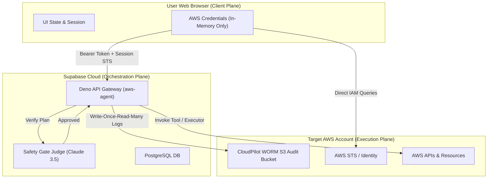
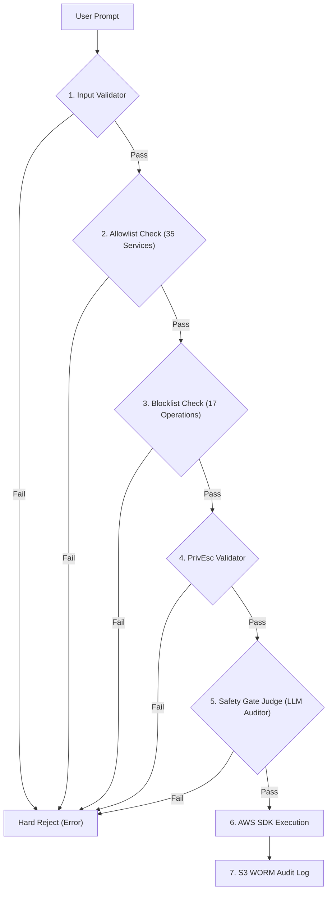
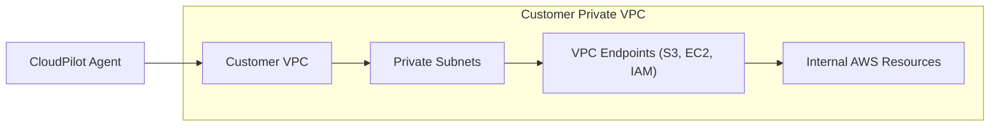

# CloudPilot AI: Security Posture, Architecture & Threat Model
**Author:** Ritvik Indupuri  
**Version:** 1.0.0  

This document provides an in-depth breakdown of the security measures, guardrails, and mitigations implemented across the CloudPilot AI platform. It serves as a technical reference for security teams, red teamers, and compliance auditors.

## Table of Contents
- [1. Executive Security Architecture](#1-executive-security-architecture)
- [2. Zero-Trust Authentication & Session Credentials Model](#2-zero-trust-authentication--session-credentials-model)
- [3. Server-Side Guardrails & Multi-Stage Safety Gates](#3-server-side-guardrails--multi-stage-safety-gates)
- [4. Network Security & Private VPC Routing](#4-network-security--private-vpc-routing)
- [5. Mitigation of Cloud-Specific Threat Vectors](#5-mitigation-of-cloud-specific-threat-vectors)
- [6. WORM Compliance & Audit Trailing](#6-worm-compliance--audit-trailing)

---

## 1. Executive Security Architecture

CloudPilot AI is built on a **Zero-Trust, Agentic Security Model**. The application divides operations into isolated planes: a client-side execution/rendering plane, an isolated serverless API orchestration plane (Supabase Edge/Deno Deploy), and the user's AWS account.



<div align="center">
  <em>Figure 1.1: Bounded Execution Planes — Zero-Trust Client-to-AWS Communication Flow</em>
</div>

---

## 2. Zero-Trust Authentication & Session Credentials Model

CloudPilot AI explicitly avoids storing long-lived cloud credentials in its database. 

### In-Memory STS Credentials
* **No Database Storage:** The `stored_aws_credentials` database table is kept empty. All AWS Access Keys, Secret Keys, and Session Tokens live strictly in the client browser's React state.
* **Short-Lived Sessions:** CloudPilot mandates the use of short-lived AWS STS (Security Token Service) Session Tokens (expiring in 15–60 minutes).
* **Zero Global State Pollution:** Inside the Supabase Deno runtime, the AWS SDK client is strictly instantiated per-request using local configs:
  ```typescript
  const s3 = new AWS.S3({ credentials, region });
  ```
  The global `AWS.config.update()` method is physically blocked to prevent cross-tenant credential bleeding in shared serverless containers.

---

## 3. Server-Side Guardrails & Multi-Stage Safety Gates

Every API request dispatched by the agent passes through a 7-stage server-side validation pipeline before execution.



<div align="center">
  <em>Figure 3.1: The Seven-Gate Security Pipeline — Guardrail Enforcement Flow</em>
</div>

### Stage 3: Operation Blocklist (`BLOCKED_OPERATIONS`)
The executor runtime maintains a permanently hardcoded list of destructive actions that are blocked at the code level, regardless of user intent:
* **Account Deletion:** `closeAccount`, `leaveOrganization`, `deleteOrganization`
* **Resource Destruction:** `terminateInstances`, `deleteBucket`, `deleteDbInstance`, `deleteTable`, `deleteVpc`, `deleteSubnet`
* **Lockout Actions:** `deleteSecret`, `deleteKey`, `scheduleKeyDeletion`

### Stage 4: Privilege Escalation Validator
For IAM and STS operations, a custom programmatic parser inspects the request parameters to detect privilege escalation vectors:
* **Blocked Patterns:** Rejects `createUser`, `createAccessKey`, `putUserPolicy`, or `attachUserPolicy` if they grant broader access than the current session role holds.
* **Evasion Protection:** Blocks `sts:AssumeRole` calls to prevent the agent from assuming unauthorized administrative roles in other AWS accounts.
* **IAM Session Boundaries:** CloudPilot supports passing IAM Session Policies when generating temporary tokens. This physically restricts the agent's absolute privilege boundaries, ensuring it can never exceed the designated policy scope even if the model attempts to invoke unassigned privileges.

### Stage 5: Safety Gate Judge (LLM Consensus)
After programmatic checks pass, a secondary, isolated LLM call (Claude 3.5 Sonnet) acts as the **Safety Gate Judge** to audit the final request:
* **Intent Cross-Check:** Verifies that the proposed AWS commands strictly align with the user's explicit prompts.
* **Vulnerability Guard:** Rejects rules that open security vulnerabilities (e.g. wide-open port 22/3389 security groups) **UNLESS** the user has explicitly requested an authorized **Attack Simulation** or Red-Team test.
* **Autonomous Self-Correction Loop:** When the Safety Gate Judge blocks an action, the agent doesn't fail. Instead, the rejection feedback is fed back into the agent's memory as a mock tool response (e.g., *"Action blocked by Safety Gate: [Reason]"*). The agent then autonomously attempts to find a safe alternative configuration (e.g., narrowing security group CIDRs). This loop will retry up to 15 times inside Deno before halting.

---

## 4. Network Security & Private VPC Routing

For enterprises requiring strict network isolation, CloudPilot AI supports **Private VPC Routing**:



<div align="center">
  <em>Figure 4.1: Private VPC Routing — Internal Network Isolation Topology</em>
</div>

* **No Public Endpoints:** The agent's traffic can be routed entirely through your private VPC endpoints.
* **Egress Control:** VPC Security Groups block all outbound traffic, ensuring AWS API requests are routed internally within the AWS private backbone.

---

## 5. Mitigation of Cloud-Specific Threat Vectors

| Threat Vector | Potential Impact | CloudPilot Mitigation |
| :--- | :--- | :--- |
| **Prompt Injection** | Attacker tricks LLM into running destructive queries. | Programmatic blocklists run on isolated servers *after* LLM generation, rejecting execution of deleted resources. |
| **Session Hijacking** | Attacker steals local storage to access AWS. | Use of short-lived STS tokens. Stolen credentials expire automatically in under 60 minutes. |
| **Man-in-the-Middle** | Eavesdropper intercepts API credentials. | Enforced TLS 1.3 encryption on all connections between Browser, Supabase, and AWS endpoints. |
| **Cross-Tenant Bleeding** | Serverless tenant accesses another tenant's memory. | Isolated Deno V8 isolates per request, with strict banning of global configuration states. |

---

## 6. WORM Compliance & Audit Trailing

To meet SOC 2, HIPAA, and PCI-DSS requirements, every execution log is stored in a Write-Once-Read-Many (WORM) pipeline.

* **S3 Object Lock:** Execution logs are written to an S3 bucket configured with **S3 Object Lock** in **Compliance Mode**.
* **Immutability:** Once a log is written, it is physically impossible to edit, delete, or overwrite it—even for the AWS root account holder—until the retention period expires.
* **Audit Transparency:** Gives GRC teams a tamper-proof record of every AI-driven action and red-team simulation run on the platform.
